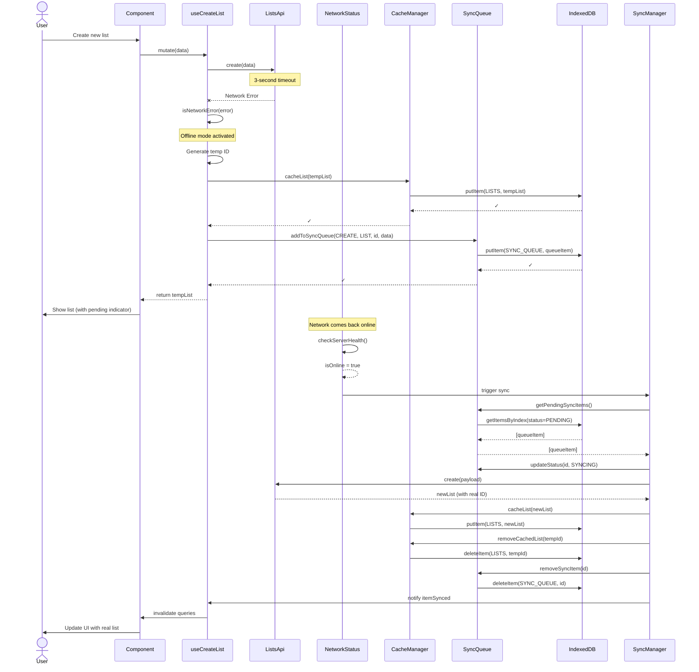
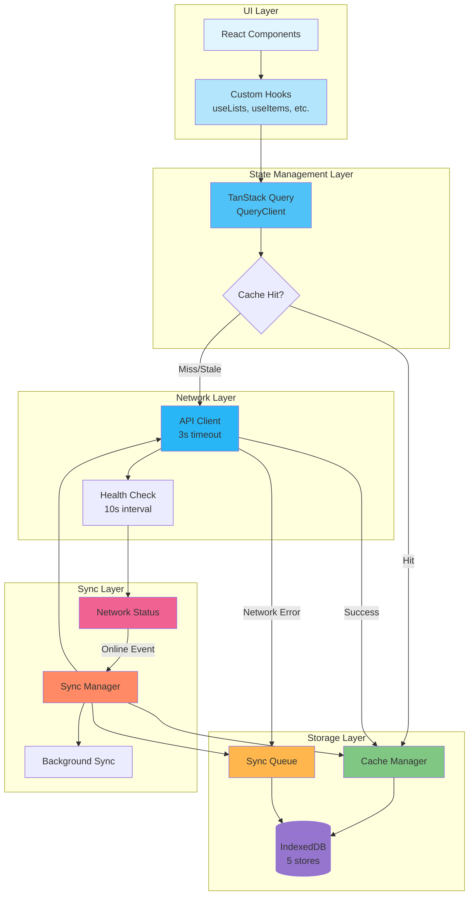

# Client-Side Cache Mechanism Architecture

## UML Class Diagram

```mermaid
classDiagram
    %% Core Storage Layer
    class IndexedDB {
        -dbInstance: IDBDatabase
        -DB_NAME: "lists-viewer-db"
        -DB_VERSION: 1
        +initDB() Promise~IDBDatabase~
        +getItem(storeName, key) Promise~T~
        +getAllItems(storeName) Promise~T[]~
        +getItemsByIndex(storeName, indexName, value) Promise~T[]~
        +putItem(storeName, value) Promise~void~
        +putItems(storeName, values) Promise~void~
        +deleteItem(storeName, key) Promise~void~
        +clearStore(storeName) Promise~void~
    }

    class Stores {
        <<enumeration>>
        +LISTS: "lists"
        +ITEMS: "items"
        +SYNC_QUEUE: "syncQueue"
        +CACHE: "cache"
        +USER: "user"
    }

    %% Cache Manager Layer
    class CacheManager {
        +cacheList(list: List) Promise~void~
        +cacheLists(lists: List[]) Promise~void~
        +getCachedList(listId: string) Promise~List~
        +getCachedLists() Promise~List[]~
        +removeCachedList(listId: string) Promise~void~
        +cacheItem(item: Item) Promise~void~
        +cacheItems(items: Item[]) Promise~void~
        +getCachedItem(itemId: string) Promise~Item~
        +getCachedItemsByList(listId: string) Promise~Item[]~
        +removeCachedItem(itemId: string) Promise~void~
        +cacheUserPreferences(key, value) Promise~void~
        +getCachedUserPreference(key) Promise~T~
    }

    %% Sync Queue Management
    class SyncQueue {
        +addToSyncQueue(operation, resource, id, payload, version) Promise~SyncQueueItem~
        +getPendingSyncItems() Promise~SyncQueueItem[]~
        +getFailedSyncItems() Promise~SyncQueueItem[]~
        +updateSyncItemStatus(id, status, error) Promise~void~
        +removeSyncItem(id) Promise~void~
        +clearSyncedItems() Promise~number~
        +retryFailedItems() Promise~number~
        +getPendingSyncCount() Promise~number~
        +hasPendingSync() Promise~boolean~
        +getSyncQueueStats() Promise~SyncQueueStats~
    }

    class SyncQueueItem {
        +id: string
        +timestamp: string
        +operationType: OperationType
        +resourceType: ResourceType
        +resourceId: string
        +parentId?: string
        +payload: unknown
        +version: number
        +retryCount: number
        +status: SyncStatus
        +error?: string
        +lastAttempt?: string
    }

    %% Sync Manager
    class SyncManager {
        -isSyncing: boolean
        -listeners: Set~SyncListener~
        -itemSyncedListeners: Set~ItemSyncedListener~
        -status: SyncStatus
        +addListener(listener: SyncListener) Function
        +addItemSyncedListener(listener) Function
        +getStatus() SyncStatus
        +startSync() Promise~void~
        -syncItem(item: SyncQueueItem) Promise~void~
        -executeOperation(item: SyncQueueItem) Promise~void~
        -executeListOperation(type, id, payload) Promise~void~
        -executeItemOperation(type, id, parentId, payload) Promise~void~
        -notifyListeners(status, progress) void
        -notifyItemSynced(itemId, resourceType) void
    }

    %% Network Status
    class NetworkStatusService {
        -listeners: Set~NetworkStatusListener~
        -_isOnline: boolean
        -healthCheckTimer: Timer
        -isChecking: boolean
        +isOnline: boolean
        +addListener(listener) Function
        +removeListener(listener) void
        -init() void
        -startHealthChecks() void
        -checkServerHealth() Promise~void~
        -handleOnline() void
        -handleOffline() void
    }

    %% React Query Integration
    class QueryClient {
        <<TanStack Query>>
        +getQueryData(key) T
        +setQueryData(key, data) void
        +invalidateQueries(key) Promise~void~
        +prefetchQuery(key, fn) Promise~void~
    }

    %% Custom Hooks
    class useLists {
        +queryKey: string[]
        +queryFn() Promise~List[]~
        +placeholderData() List[]
        +staleTime: 30000
        +retry: false
        ---
        Fetches from API with 3s timeout
        Falls back to IndexedDB cache
        Caches results automatically
    }

    class useCreateList {
        +mutationFn(data) Promise~List~
        +onSuccess() void
        ---
        Creates via API if online
        Creates temp record if offline
        Adds to sync queue offline
        Updates cache immediately
    }

    class useUpdateList {
        +mutationFn(listId, data) Promise~List~
        +onSuccess() void
        ---
        Updates via API if online
        Updates cache + queue if offline
        Optimistic locking with version
    }

    class useDeleteList {
        +mutationFn(listId, version) Promise~void~
        +onSuccess() void
        ---
        Deletes via API if online
        Queues for sync if offline
        Removes from cache
    }

    class useItems {
        +queryKey: string[]
        +queryFn() Promise~Item[]~
        +enabled: boolean
        ---
        Similar pattern to useLists
        Filtered by listId
    }

    %% API Client Layer
    class ApiClient {
        +baseURL: string
        +timeout: 3000
        +get(url, config) Promise~T~
        +post(url, data, config) Promise~T~
        +put(url, data, config) Promise~T~
        +delete(url, config) Promise~T~
        +isNetworkError(error) boolean
        ---
        Axios-based HTTP client
        3-second timeout for offline detection
    }

    class ListsApi {
        +getAll() Promise~List[]~
        +getById(id) Promise~List~
        +create(data) Promise~List~
        +update(id, data) Promise~List~
        +delete(id, version) Promise~void~
    }

    class ItemsApi {
        +getByListId(listId) Promise~Item[]~
        +getById(listId, itemId) Promise~Item~
        +create(listId, data) Promise~Item~
        +update(listId, itemId, data) Promise~Item~
        +delete(listId, itemId, version) Promise~void~
        +bulkComplete(listId, itemIds) Promise~Item[]~
        +reorder(listId, items) Promise~void~
        +move(listId, itemId, data) Promise~Item~
    }

    %% Relationships
    IndexedDB <.. Stores : uses
    CacheManager --> IndexedDB : uses
    SyncQueue --> IndexedDB : uses
    SyncQueue ..> SyncQueueItem : manages
    
    SyncManager --> SyncQueue : reads/updates
    SyncManager --> NetworkStatusService : monitors
    SyncManager --> ListsApi : syncs via
    SyncManager --> ItemsApi : syncs via
    SyncManager --> CacheManager : updates after sync
    
    NetworkStatusService --> ApiClient : health checks
    
    useLists --> QueryClient : integrates
    useLists --> ListsApi : fetches from
    useLists --> CacheManager : reads/writes
    useLists ..> ApiClient : error detection
    
    useCreateList --> QueryClient : updates
    useCreateList --> ListsApi : creates via
    useCreateList --> CacheManager : caches
    useCreateList --> SyncQueue : queues when offline
    
    useUpdateList --> QueryClient : updates
    useUpdateList --> ListsApi : updates via
    useUpdateList --> CacheManager : caches
    useUpdateList --> SyncQueue : queues when offline
    
    useDeleteList --> QueryClient : updates
    useDeleteList --> ListsApi : deletes via
    useDeleteList --> CacheManager : removes from
    useDeleteList --> SyncQueue : queues when offline
    
    useItems --> QueryClient : integrates
    useItems --> ItemsApi : fetches from
    useItems --> CacheManager : reads/writes
    
    ListsApi --> ApiClient : uses
    ItemsApi --> ApiClient : uses
    
    QueryClient ..> CacheManager : fallback to

    %% Notes
    note for IndexedDB "5 Object Stores:\n- lists (id, updatedAt, createdBy indexes)\n- items (id, listId, type, completed, order indexes)\n- syncQueue (id, status, timestamp indexes)\n- cache (key-value pairs)\n- user (user preferences)"
    
    note for SyncManager "Background Sync:\n- Triggered on network online event\n- Processes queue in FIFO order\n- Exponential backoff on failures\n- Max 5 retry attempts\n- Notifies listeners of progress"
    
    note for NetworkStatusService "Health Monitoring:\n- Browser online/offline events\n- Server health checks every 10s\n- 3-second timeout per check\n- Self-healing mechanism"
```



## Sequence Diagram: Offline Create Operation



## Architecture Flow Diagram



## Data Flow Patterns

### Pattern 1: Online Request (Happy Path)
```
Component → Hook → React Query → API Client → Backend
                                    ↓
                                Cache Manager → IndexedDB
                                    ↓
Component ← Hook ← React Query ← [cached result]
```

### Pattern 2: Offline Request (Degraded Mode)
```
Component → Hook → React Query → API Client → [Timeout]
                                    ↓
                    Generate Temp ID → Cache Manager → IndexedDB (lists/items)
                                    ↓
                                Sync Queue → IndexedDB (syncQueue)
                                    ↓
Component ← Hook ← React Query ← [temp result with pending indicator]
```

### Pattern 3: Background Sync (Recovery)
```
Network Status → [Detects Online] → Sync Manager
                                        ↓
                            Get Pending Items ← Sync Queue ← IndexedDB
                                        ↓
                                    For Each Item:
                                    API Client → Backend
                                        ↓
                            Update Cache → IndexedDB (replace temp with real)
                                        ↓
                            Remove from Queue → IndexedDB (syncQueue)
                                        ↓
                            Notify Hooks → React Query → Invalidate
                                        ↓
                            Component ← [Re-render with synced data]
```

## Key Design Decisions

### 1. **3-Second API Timeout**
- Fast offline detection without blocking UI
- Provides quick fallback to cache
- Users see immediate feedback

### 2. **Optimistic UI with Temp IDs**
- Format: `temp-${timestamp}`
- Enables offline creation without waiting
- Visual indicators (orange background, "Pending Sync" badge)
- Replaced with real IDs after sync

### 3. **IndexedDB as Single Source of Truth**
- All data flows through IndexedDB
- Survives page refreshes
- Structured with 5 specialized stores
- Indexed for efficient queries

### 4. **React Query Integration**
- 30-second stale time
- No automatic retries (rely on sync queue)
- Placeholder data from cache
- Optimistic updates for instant feedback

### 5. **FIFO Sync Queue**
- Operations processed in order
- Exponential backoff (1s → 60s)
- Max 5 retry attempts
- Status tracking (PENDING → SYNCING → SYNCED/FAILED)

### 6. **Network Status with Health Checks**
- Don't trust browser online/offline events alone
- Poll server health every 10 seconds
- 3-second timeout per health check
- Triggers sync automatically when online

### 7. **Optimistic Locking**
- Version field on all resources
- Prevents lost updates in concurrent scenarios
- Conflicts detected and queued for retry
- User notified of version conflicts

## Cache Stores Schema

### Lists Store
```typescript
{
  keyPath: 'id',
  indexes: {
    updatedAt: { unique: false },
    createdBy: { unique: false }
  },
  data: List {
    id, name, description, version, 
    createdAt, updatedAt, itemCount, etc.
  }
}
```

### Items Store
```typescript
{
  keyPath: 'id',
  indexes: {
    listId: { unique: false },
    type: { unique: false },
    completed: { unique: false },
    order: { unique: false },
    listId_order: { unique: false }  // Compound index
  },
  data: Item {
    id, listId, name, type, completed, 
    order, version, quantity, etc.
  }
}
```

### Sync Queue Store
```typescript
{
  keyPath: 'id',
  indexes: {
    status: { unique: false },
    timestamp: { unique: false },
    status_timestamp: { unique: false }  // Compound index
  },
  data: SyncQueueItem {
    id, timestamp, operationType, resourceType,
    resourceId, payload, version, retryCount,
    status, error, lastAttempt
  }
}
```

### Cache Store (Key-Value)
```typescript
{
  keyPath: 'key',
  data: {
    key: string,
    value: unknown,
    timestamp: string
  }
}
```

### User Store
```typescript
{
  keyPath: 'id',
  data: {
    id, username, iconId, 
    preferences: { theme, language }
  }
}
```

## Performance Characteristics

- **First Load**: ~50ms (IndexedDB read)
- **Cache Hit**: <10ms (memory → IndexedDB)
- **API Success**: ~100-500ms (network + cache update)
- **API Timeout**: 3000ms (then fallback to cache)
- **Sync Cycle**: 100ms delay between operations
- **Health Check**: Every 10 seconds

## Error Handling Strategy

1. **Network Errors**: Fall back to cache, queue operation
2. **Version Conflicts**: Queue for retry, notify user
3. **Validation Errors**: Show immediately, don't queue
4. **Sync Failures**: Exponential backoff, max 5 retries
5. **Database Errors**: Log and show generic error message
